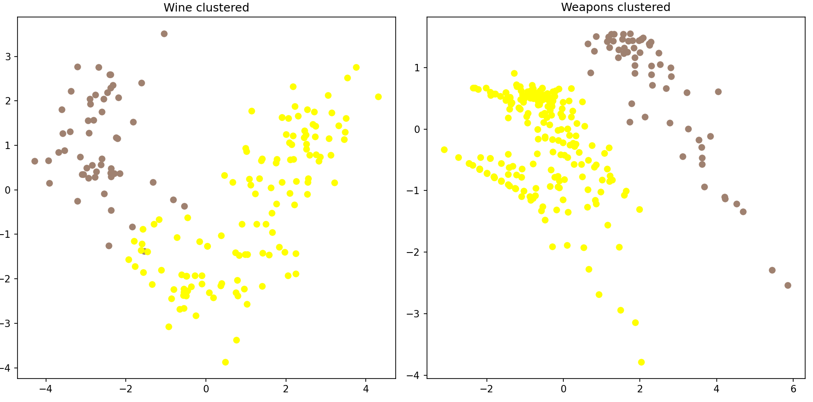
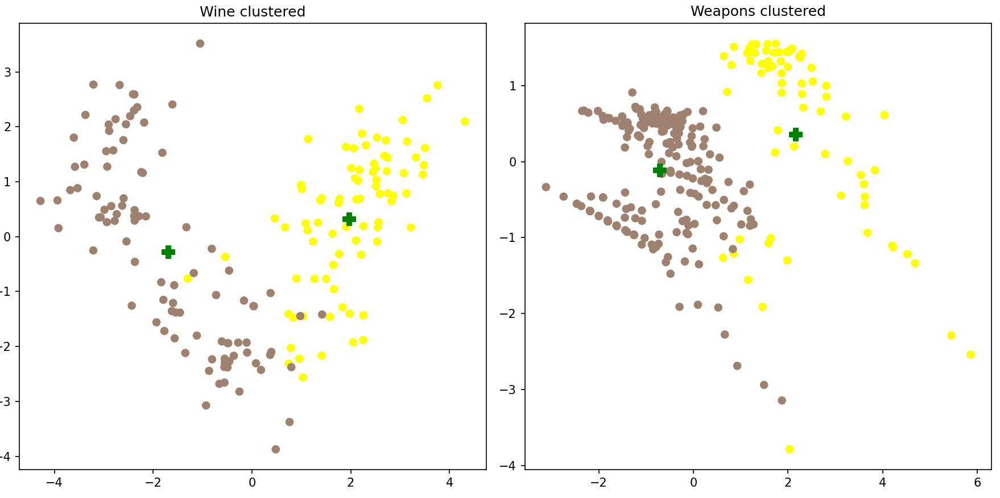
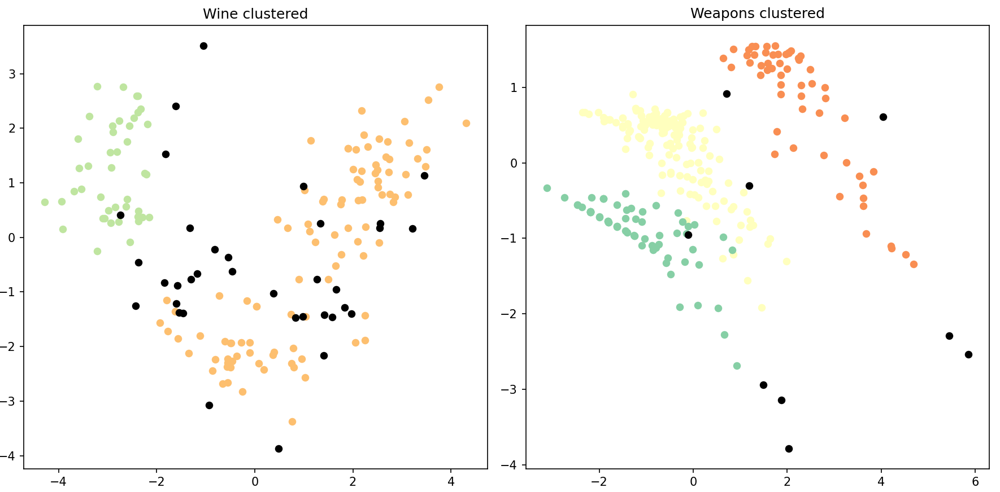
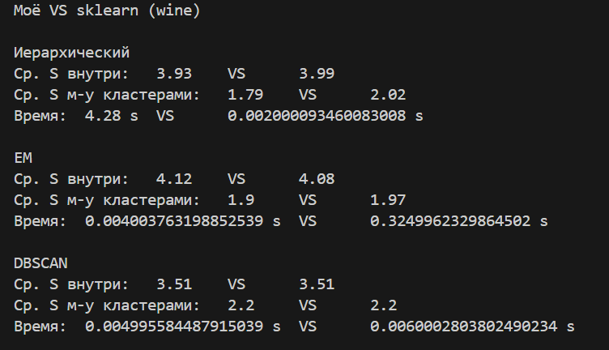
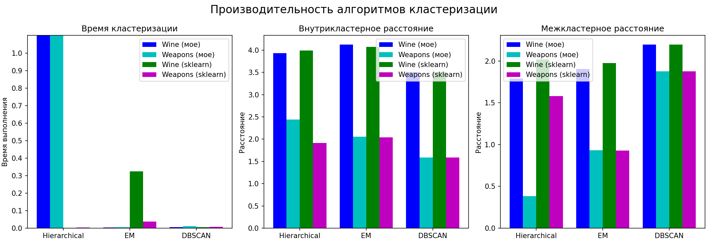

# Лабораторная работа №1

# Визуализация данных
### Датасет 1: Wine

[Ссылка на датасет](https://www.kaggle.com/datasets/harrywang/wine-dataset-for-clustering)

Кластеры соединены перемычками, число кластеров предположительно равно 3.

### Датасет 2: Skyrim Weapons 
[Ссылка на датасет](https://www.kaggle.com/datasets/elmartini/skyrim-weapons-dataset)

Предположительно 3 кластера ленточного типа.

# Иерархический алгоритм и дендрограмма
После кластеризации:

По дендрограммам можно определить оптимальное число кластеров для обоих датасетов - 2.

# EM-алгоритм

На рисунке показано распределение меток на построенных данных для обоих датасетов. Данные были преобразованы к стандартному распределению при помощи `StandardScaler` из библиотеки `sklearn`. К обработанным данным был применен PCA.

# DBSCAN

На рисунке показано распределение меток на построенных данных; `e = 2.5`, `min_samples = 12` в случае wine и `e = 1`, `min_samples = 4` для датасета weapons. Во втором случае алгоритм выделяет три кластера.

# Сравнение с эталоном и метрики
### Wine

Видно, что результаты кастомных реализаций всех трех алгоритмов схожи с результатами алгоритмов sklearn за исключением времени работы: моему иерархическому алгоритму потребовалось 4.28 секунды против 2 мс для реализации sklearn, однако кастомные реализации EM (0.004 сек) и DBSCAN (0.005 сек) оказались быстрее библиотечных вариантов, которым потребовалось 0.325 и 0.006 секунд.

### Skyrim Weapons

На втором датасете кастомный алгоритм иерархической кластеризации показал себя хуже по всем показателям: внутрикластерному и межкластерному расстояниям, а также времени работы. EM и DBSCAN повторно показали идентичные эталонным реализациям результаты, а кастомный EM опередил версию sklearn.

Здесь наглядно представлены результаты работы алгоритмов по упомянутым ранее метрикам: среднему внутрикластерному расстоянию, среднему межкластерному расстоянию и времени работы.
